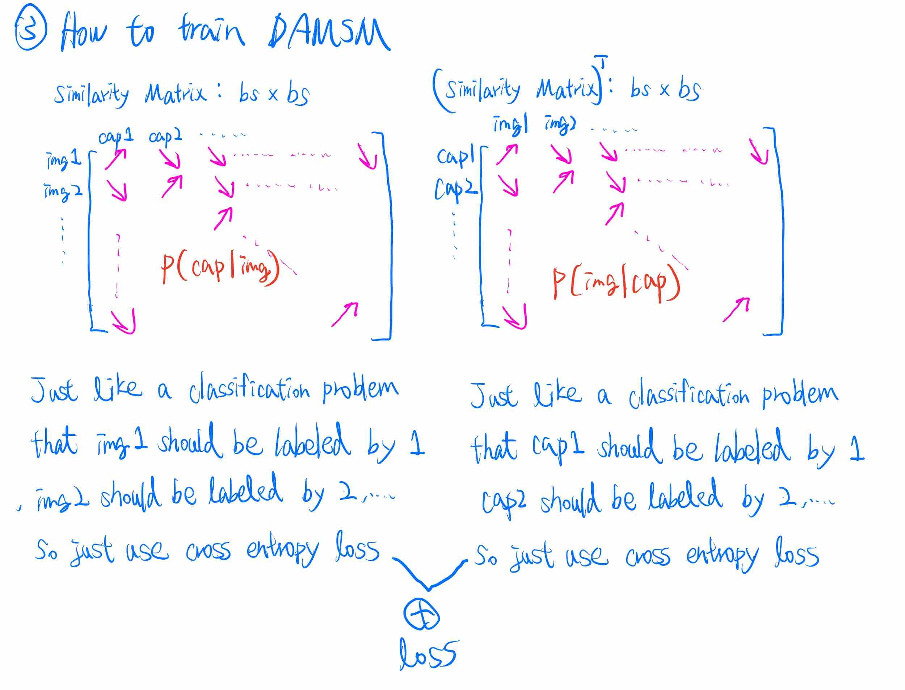

# Deep t2i
> My Experients of text to image using deep learning

1. Generate 256x256 bird image from natural text.
2. Generate 64x64 anime faces image from specific tags.

## Video

I made a explanation video using chinese: 

## Training and Result

Please check these notebooks which contain the full training process. 
([20a_Train_Anime_Heads_DAMSM.ipynb](nbs/20a_Train_Anime_Heads_DAMSM.ipynb), [20b_Train_Anime_Heads_GAN.ipynb](nbs/20b_Train_Anime_Heads_GAN.ipynb), [20c_Train_Birds_DAMSM.ipynb](nbs/20c_Train_Birds_DAMSM.ipynb), [20d_Train_Birds_GAN.ipynb](nbs/20d_Train_Birds_GAN.ipynb) )

Notice that for birds dataset, the results are not always good. The followings are which I choosed that looks good.

You can check [birds_results](https://drive.google.com/file/d/1ZtjY0zswy37DDxHV0JvLhawhthP9ae1M/view?usp=sharing)  or [anime_heads_results](https://drive.google.com/file/d/1PqbnvfK_aha0Pqge16ETLrr7TqNC-xxM/view?usp=sharing) to get the result images during training process for each epoch.

## Data

* Birds:
    + [CUB-200](http://www.vision.caltech.edu/visipedia/CUB-200-2011.html)
    + [Birds Captions from AttnGAN](https://drive.google.com/open?id=1O_LtUP9sch09QH3s_EBAgLEctBQ5JBSJ)
* Anime faces
    + [Simple anime faces data](https://drive.google.com/uc?export=download&id=1tpW7ZVNosXsIAWu8-f5EpwtF3ls3pb79)
    + This data is from this [course](http://speech.ee.ntu.edu.tw/~tlkagk/courses_MLDS18.html) 

## Model Architecture

DAMSM

GAN

The architecture design is largely inspired by [Attn-GAN](https://github.com/taoxugit/AttnGAN), [MSG-GAN](https://github.com/akanimax/BMSG-GAN), [SA-GAN](https://arxiv.org/abs/1805.08318) and [Pro-GAN](https://arxiv.org/abs/1710.10196).

1. Skip connection from MSG-GAN
2. Attention and DAMSM from AttnGAN, 
3. SelfAtten, Spectral norm, Batch Norm from SAGAN
4. Architecture and running average of the generator weights from ProGAN but add some residual and attention

Please check this notebook to get more details of my model architecture. ( [03a_model.ipynb](nbs/03a_model.ipynb) )

Check these notebooks to get details of the loss and training. ( [04a_trainer_DAMSM.ipynb](nbs/04a_trainer_DAMSM.ipynb), [04b_trainer_GAN.ipynb](nbs/04b_trainer_GAN.ipynb) )

## Pretrained Model

[Exported Anime Face Model](https://drive.google.com/file/d/1pp696JJCD5ng3C7klhHS5Q7_iTKtEpjs/view?usp=sharing)  
[Exported Birds Model](https://drive.google.com/file/d/1phNW_utePcz188jDuqRhMYspPXJZNpMT/view?usp=sharing)  

See [21a_example_inference.ipynb](nbs/21a_example_inference.ipynb) for inference example

## Flask Server and Simple Demo Site

* [Flask Server](server) that deployed on Google Cloud Run
* [Simple Demo Site](https://github.com/cwza/deep_t2i_web): Simple web interface for the flask server

## How to Develop

* Clone this repository
* Run `make install` to install deep_t2i
* Data:
    * Download [CUB-200-2011](http://www.vision.caltech.edu/visipedia-data/CUB-200-2011/CUB_200_2011.tgz) and put it to ./data/full_data/CUB-200-2011.tgz
    * Download [Birds Captions from AttnGAN](https://drive.google.com/open?id=1O_LtUP9sch09QH3s_EBAgLEctBQ5JBSJ)  and put it to ./data/full_data/birds.zip
    * Download [Simple anime faces data](https://drive.google.com/uc?export=download&id=1tpW7ZVNosXsIAWu8-f5EpwtF3ls3pb79) and put it to ./data/full_data/data.zip
    * Run `python3 ./scripts/birds_data.py` and `python3 ./scripts/anime_heads_data.py`
* Make some change in nbs/xxx.ipynb. You can add documentation in notebooks!!!
* Run `make build` to generate code from jupyter notebooks to ./deep_t2i
* Run `make test` to do some unit test
* Run `make build-all` to also generate documentation from notebooks
* Git push

## How to Train

* Clone this repository
* Run `make install` to install deep_t2i
* Data:
    * Download [CUB-200-2011](http://www.vision.caltech.edu/visipedia-data/CUB-200-2011/CUB_200_2011.tgz) and put it to ./data/full_data/CUB-200-2011.tgz
    * Download [Birds Captions from AttnGAN](https://drive.google.com/open?id=1O_LtUP9sch09QH3s_EBAgLEctBQ5JBSJ)  and put it to ./data/full_data/birds.zip
    * Download [Simple anime faces data](https://drive.google.com/uc?export=download&id=1tpW7ZVNosXsIAWu8-f5EpwtF3ls3pb79) and put it to ./data/full_data/data.zip
    * Run `python3 ./scripts/birds_data.py` and `python3 ./scripts/anime_heads_data.py`
* See ./nbs/20c_Train_Birds_DAMSM.ipynb for training DAMSM
* See ./nbs/20d_Train_Birds_GAN.ipynb for training and getting exported model
* See ./nbs/21a_example_inference.ipynb for inference
